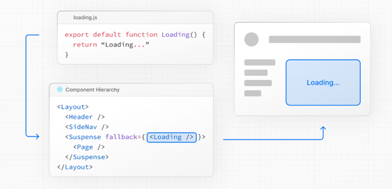

# next-starter

https://nextjs.org/docs
공식 문서 읽기

## Main Features
- Routing
    - app router
    - pages router
- Rendering
- Data Fetching : extended fetch API for request memoization, data caching and revalidation
- Optimizations
- TypeScript

## Routing Fundamentals
- tree
- subtree
- root
- leaf

- url segment
- url path : composed of segments
  next.com/dashboard/settings
  domain/segment/segment

## Pages
A page is UI that is unique to route.

## Layouts and Templates
The special files layout.js and template.js allow to create UI that is shared between routes

## Linking and Navigating

- <Link> Component
- Using useRouter hook
- Using the redirect function
- Using the native History API

The App Router uses a hybrid approach for routing and navigation. 
On the server, your application code is automatically code-split by route segments. And on the client, Next.js prefetches and caches the route segments. 
This means, when a user navigates to a new route, the browser doesn't reload the page, 
and only the route segments that change re-render - improving the navigation experience and performance.

## Error Handling
- Model expected errors as return values
- Use error boundaries for unexpected errors (error.tsx, global-error.tsx)

## Loading UI and Streaming
loading.tsx

## Redirecting

