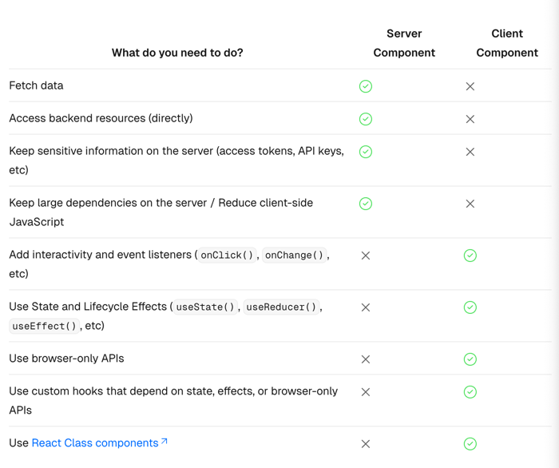

# next-starter

https://nextjs.org/docs
공식 문서 읽기


## Main Features
- Routing
    - app router
    - pages router
- Rendering
- Data Fetching : extended fetch API for request memoization, data caching and revalidation
- Optimizations
- TypeScript

## Routing

### Routing Fundamentals
- tree
- subtree
- root
- leaf

- url segment
- url path : composed of segments
  next.com/dashboard/settings
  domain/segment/segment


### Pages
A page is UI that is unique to route.

### Layouts and Templates
The special files layout.js and template.js allow to create UI that is shared between routes

### Linking and Navigating

- <Link> Component
- Using useRouter hook
- Using the redirect function
- Using the native History API

The App Router uses a hybrid approach for routing and navigation. 
On the server, your application code is automatically code-split by route segments. And on the client, Next.js prefetches and caches the route segments. 
This means, when a user navigates to a new route, the browser doesn't reload the page, 
and only the route segments that change re-render - improving the navigation experience and performance.


### Error Handling
- Model expected errors as return values
- Use error boundaries for unexpected errors (error.tsx, global-error.tsx)

### Loading UI and Streaming
loading.tsx


### Redirecting
- redirect
- permanentRedirect
- useRouter
- redirects in next.config.js
- NextResponse.redirect

### Route Groups
A route group can be created by wrapping a folder's name in parenthesis : (folderName)

### Dynamic Routes
A Dynamic Segment can be created by wrapping a folder's name in square brackets: [folderName]. 
For example, [id] or [slug].

- Generating Static Params: generateStaticParams
- Catch-all Segments : app/shop/[...slug]/page.js
- Optional Catch-all Segments : app/shop/[[...slug]]/page.js


### Parallel Routes

- admin, user
- login signup
- loading.js, error.js

```
export default function Layout({
  children,
  team,
  analytics,
}: {
  children: React.ReactNode
  analytics: React.ReactNode
  team: React.ReactNode
}) {
  return (
    <>
      {children}
      {team}
      {analytics}
    </>
  )
}
```

### Intercepting Routes
photo

### Route Handlers
Route Handlers allow you to create custom request handlers for a given route using the Web Request and Response APIs.

app/api
  route.js


### Middleware
Middleware allows you to run code before a request is completed. Then, based on the incoming request, you can modify the response by rewriting, redirecting, modifying the request or response headers, or responding directly.

```
import { NextResponse } from 'next/server'
import type { NextRequest } from 'next/server'
 
export function middleware(request: NextRequest) {
  if (request.nextUrl.pathname.startsWith('/about')) {
    return NextResponse.rewrite(new URL('/about-2', request.url))
  }
 
  if (request.nextUrl.pathname.startsWith('/dashboard')) {
    return NextResponse.rewrite(new URL('/dashboard/user', request.url))
  }
}
```

Using Cookies, Setting Headers, CORS, Producing a Response
Unit Testing

### Internationalization

## Data Fetching

### Data Fetching and Caching
fetch
next.js unstable_cache

parallel and sequential data fetching

```
const artistData = getArtist(username)
const albumsData = getAlbums(username)

// Initiate both requests in parallel
const [artist, albums] = await Promise.all([artistData, albumsData])
```

preloading data

### Server Actions and Mutations
Server Actions are asynchronous functions thar are executed on the server.
They can be called in Server and Client Components to handle from submissions and data mutations in Next.js applications

### Incremental Static Regeneration (ISR)
- Update static content without rebuilding the entire site
- Reduce server load by serving prerendered, static pages for most requests
- Ensure proper cache-control headers are automatically added to pages
- Handle large amounts of content pages without long next build times

## Rendering

### Server Components
React Server Components allow you to write UI that can be rendered and optionally cached on the server.
In Next.js the rendering work is further split by route segments to enable streaming and partial rendering, and there are three
different server rendering strategies
- static rendering
- dynamic rendering
- streaming

Benefits of Server Rendering
- data fetching
- security
- caching
- performance
- initial page load and first contentful paint
- search engine optimization and social network shareability
- streaming

### Client Components
Client Components allow you to write interactive UI that is prerendered on the server and can use client JavaScript to run in the browser

Benefits of client Rendering
- interactivity : Client Components can use state, effects, and event listeners, meaning they can provide immediate feedback to the user and update the UI
- Browser APIs : Client Components have access to browser APIs, geolocation or localStorage

### Server and Client Composition Patterns


Sharing data between components
use server-only package

